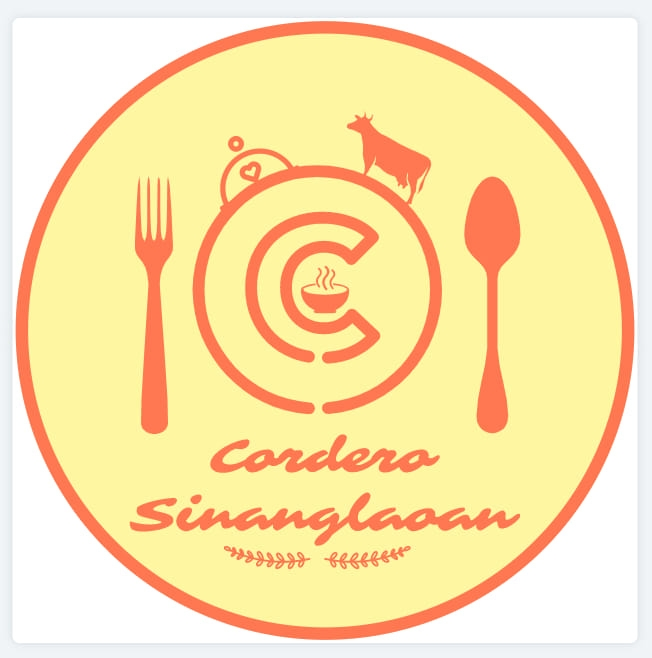

# Cordero Sinanglaoan Website

An elegant, responsive restaurant website redesign for **Cordero Sinanglaoan**, featuring traditional Filipino cuisine.



## 🌟 Features

- **Modern & Elegant Design**: A sophisticated aesthetic using deep greens, gold accents, and parallax effects.
- **Responsive Layout**: Fully functional on desktop, tablets, and mobile devices.
- **Interactive Menu**: Grid-based menu layout with smooth hover effects.
- **Sticky Navigation**: Easy access to menu categories while scrolling.
- **Mobile Support**: Touch-friendly hamburger menu for smaller screens.

## 🛠️ Technologies Used

- **HTML5**: Semantic structure.
- **CSS3**: Custom properties (variables), Grid, Flexbox, and Animations.
- **JavaScript (Vanilla)**: DOM manipulation, event handling, and scroll effects.
- **Google Fonts**: `Playfair Display` and `Montserrat`.
- **Font Awesome**: Icons.

## 🚀 How to Run

1.  Clone this repository or download the files.
2.  Open `index.html` in any modern web browser.

## 📂 Project Structure

```
/
├── index.html      # Main HTML file
├── style.css       # Main stylesheet
├── script.js       # Interactive logic
├── Pics/           # Image assets
└── README.md       # Project documentation
```

## 📸 Screenshots

*(Add screenshots of your actual website here after deployment)*

## 📄 License

All rights reserved to **Cordero Sinanglaoan**.
